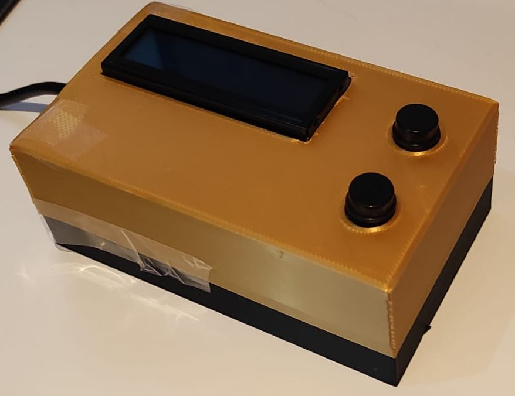
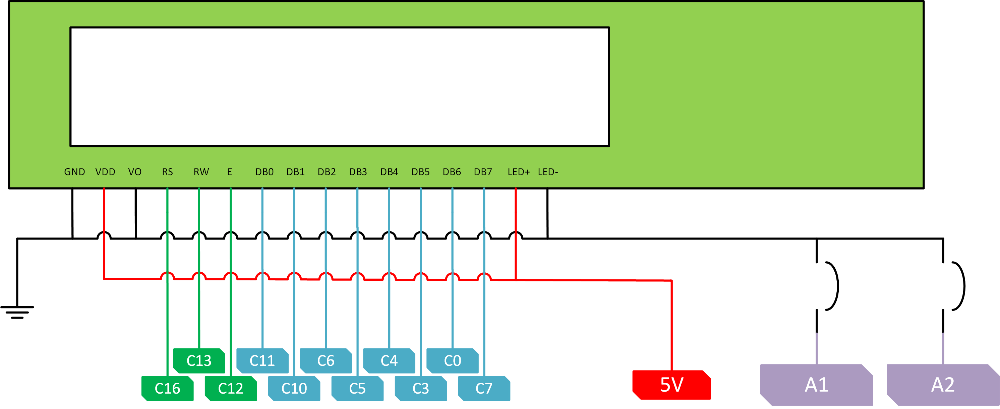

# DodgeMiP

A simple bare-metal game on a FRDM KL25Z with two buttons and a TC1602C LCD Screen.

## Setup

In order to set up this project the following steps are recommended:
- Download and install [CodeWarrior](https://www.nxp.com/design/software/development-software/codewarrior-development-tools/downloads:CW_DOWNLOADS)
- Clone the repository on the directory of your choice.
- Open CodeWarrior, create a Workspace and go to File -> Import ... -> Existing 
Projects into Workspace.
- Browse to the folder of the repository and select 
[the dodgemip project path](./dodgemip). Import the project.

You should be ready to go!

## Connections

You can modify the [pinout](./dodgemip/Project_Headers/pinout.h) file to change
the default pin settings, which are depicted in the following image. 

In the final design, buttons, +5V and GND are all connected to a small 80x30 mm PCB. The LCD is connected directly to the
KL25Z. This step is left at the discretion of the reader.

## Casing

Using the original design is somewhat discouraged, since I'm by no means an expert on the matter.
It was fun to make, but it is very clunky. Check [this](./docs/case) for my designs.

## Code Structure

Sources are split in a functional way. 
- [lcd.h](./dodgemip/Project_Headers/lcd.h) abstracts the underlying hardware of the lcd screen and allows writing text with single simple function calls.
- [input_button.h](./dodgemip/Project_Headers/input_button.h) abstracts and implements input button operations. Last input is recorded in a global structure `inputStatus_t`;
- [game.h](./dodgemip/Project_Headers/game.h) declares game functions and structures.
- [main.c](./dodgemip/Sources/main.c) implements the game.